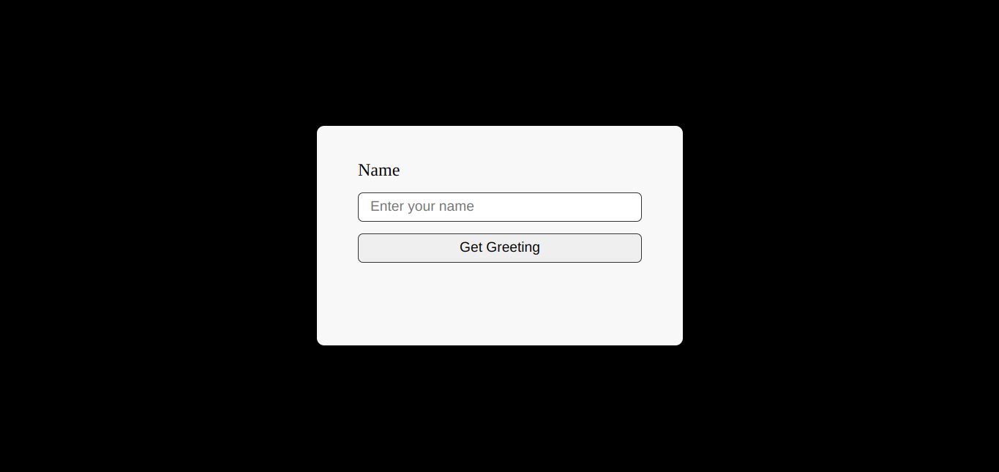

# Task of Younglabs Innovation

Simple API and Frontend page.

The webapp is live [here](https://task-frontend-smoky.vercel.app/).

## Table of contents

1. [Introduction](#introduction)
2. [Technologies used](#🚀-technologies-used)
3. [Setup](#⚙️-setup)
4. [Screenshots](#📸-screenshots)

## Introduction

The greeting app is built using ReactJs and ExpressJs. ReactJs is the popular frontend library used to make dynamic web apps. ExpressJs is the popular backend framework used for creating server and routing.

## 🚀 Technologies used

The project uses ReactJS and ExpressJS.

## ⚙️ Setup

### Installation

1. Clone this repository:
   `git clone https://github.com/premdood/task.git`
2. Navigate to the project directory:
   `cd task`
3. Navigate to client subdirectory: `cd client`
4. Install the dependencies:
   `npm install`
5. Do the same for the server subdirectory: `cd server && npm install`

### Usage

- Run the client with the following command:
  `npm run dev`
- Access it with the browser at:
  `https://localhost:5173`
- Run the server using the following command: `cd server && node server.js`

## 📸 Screenshots

